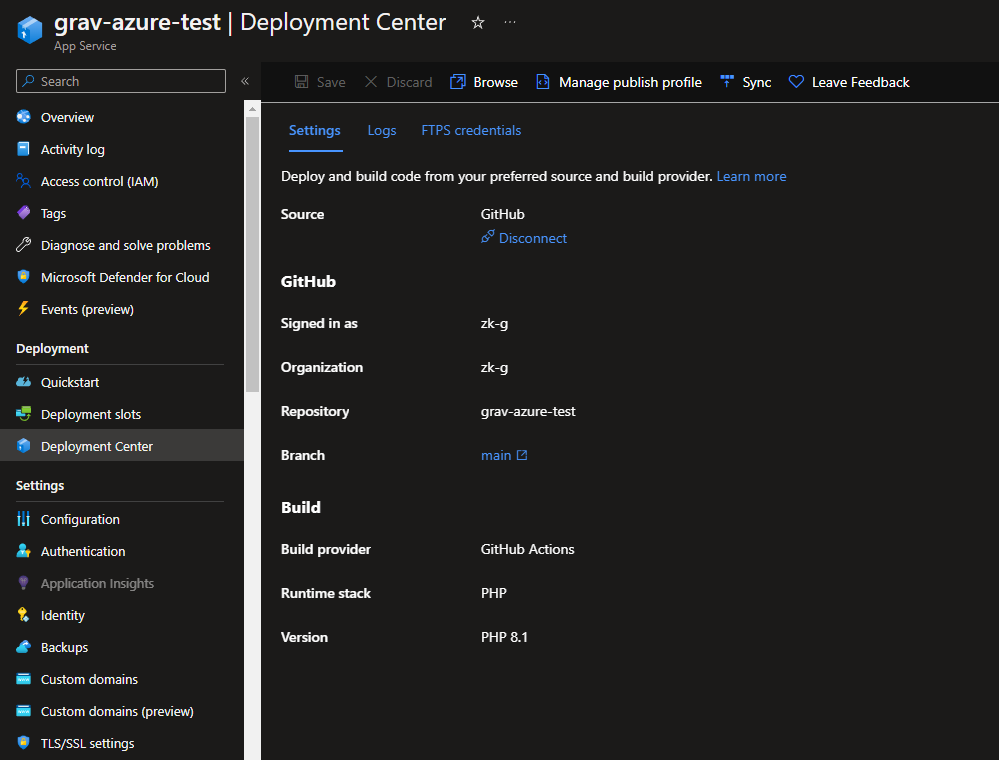
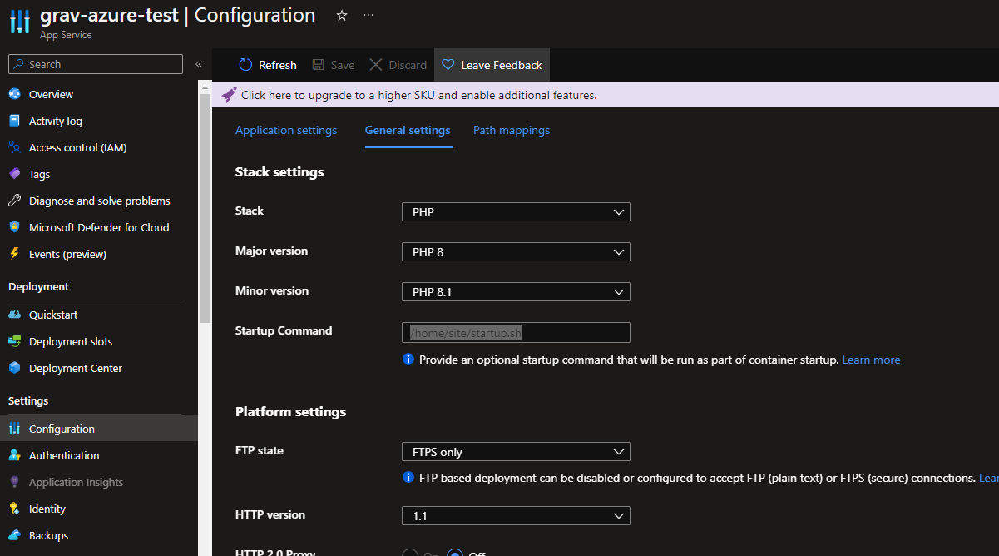
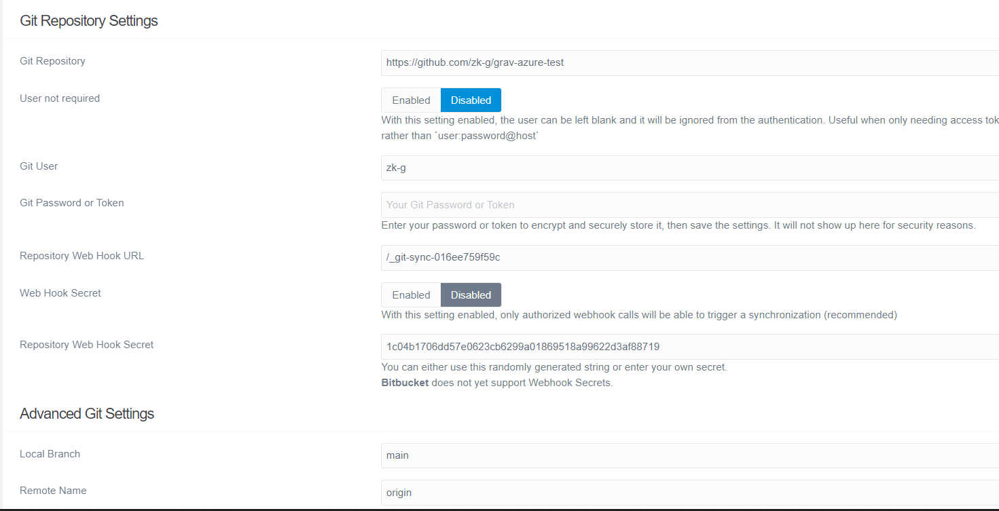

## Deploy grav to azure

- Connect webapp to github 
- Add startup.sh in the settings 

```bash
#!/bin/bash
cp /home/site/default.conf /etc/nginx/sites-available/default
service nginx reload
```

- Add default.conf file to `/home/site` (view sample in this repo)
- Install https://github.com/trilbymedia/grav-plugin-git-sync plugin on grav
- Configure git repository setting with your repo 
